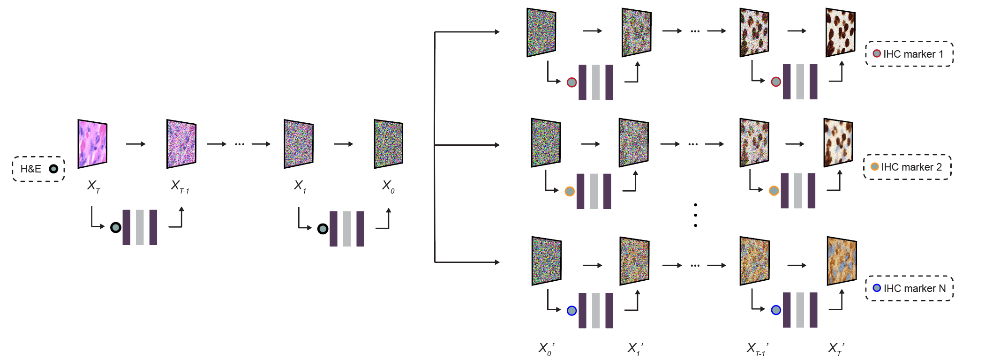

# His-MMDM: Histopathological image Multi-domain Multi-omics translation with Diffusion Models 

## Overview

This repository contains the implementation of His-MMDM from

```
Zhongxiao Li et al.,"His-MMDM: Multi-domain and Multi-omics Translation of Histopathology Images with Diffusion Models"
```
If you use our work in your research, please cite our [paper](https://www.biorxiv.org).


## The architecture of His-MMDM
<div align="center">
  
</div>

<dev align="left">
<em> Fig. 1 The architecture of Histopathological image Multi-domain Multi-omic translation with Diffusion Models (His-MMDM).</em> Based on the principle of <a href="https://arxiv.org/abs/2006.11239">Denoising Diffusion Probabilistic Models (DDPMs)</a>, the forward diffusion procedure gradually diffuses a histopathological image into a noisy image following a Gaussian distribution. The backward procedure takes in the noisy image and gradually denoises it back into a real histopathological image under the the target domain conditions. A U-net-based network makes noise prediction for a given input and takes in condition information in the format of categorical labels, genomic profiles, and transcriptomic profiles in its embedding layers.
</div>

## Dependencies
### Create a Conda environment
Prepare a Conda environment named `His` that will be used later in the experiments:
```
conda create -n His python=3.10 pytorch==1.13.1 torchvision==0.14.1 torchaudio==0.13.1 pytorch-cuda=11.6 numpy==1.26.0 scipy==1.11.1 pandas==1.5.3  -c pytorch -c nvidia
```

### Install OpenMPI
Install OpenMPI via pip and make sure it is compiled and linked to the system-wide OpenMPI library:
```
CC="$(which mpicc)" pip install mpi4py==3.1.5
```

### Install other dependencies
Other small dependencies are specified in `setup.py` and can be installed automatically with the main package `cg_diffusion`:
```
pip install -e .
```

## Run Image Translation with Pre-trained Checkpoints

We provide demos as Jupyter notebooks in the `notebooks/` directory using pretrained checkpoints for the following tasks:
- *Translate across primary tumor types* This task translates histopathological images from one TCGA tumor type to another.
<div align="center">
  
</div>

- *Multi-omics guided editing* This task translates histopathological images from one genomic mutation profile to another mutation profile, or one transcriptomic profile to another transcriptomic profile.
<div align="center">
  
</div>

- *Virtual IHC staining* This task performs virtual staining on the primary brain tumor histopathological images. Given an H&E image, the model is expected to produce a virtually-stained IHC image of a specific marker type.
<div align="center">
  
</div>

### Download the respective checkpoints and data
The checkpoints and data are hosted on Amazon AWS, which will be automatically downloaded and extracted by running the downloading scripts:
```
python download.py inference
```
The checkpoints and data will be downloaded and their checksums will be validated.

### Translate images

#### The main script to translate images
The main script to start the translation of images is `scripts/run-general_image_translation.sh`, which expects three command line arguments:
```{bash}
bash scripts/run-general_image_translation.sh <config_name> <source_image_dir> <log_dir>
```
The `<config_name>` is the name of the configurations for each dataset, which is defined in the scripts under `scripts/dataset_specific_configurations` and is used in `run-general_image_translation.sh`.

`<source_image_dir>` is the directory holding the source images for translation. The demo images are held in the directories under `download/inference/demo_data/`

`<log_dir>` is the directory to save the translated images and the logs during translation.

The script `run-general_image_translation.sh` needs to be modified on your system if you want to use multiple GPUs or nodes. Depending on your system, use either `srun` or `mpirun`.

#### The format of the image dataset
The name of each image file should contain two parts separated by two underscores:
```
<categorical_class_label>__<image_id>.png
```
`<categorical_class_label>` is the name of the categorical domain that this image is in. `<image_id>` is the identifier for each image and should be unique. Some demo image datasets are under `download/inference/demo_data/`.

#### Examples in Jupyter Notebooks
The examples as Jupyter Notebooks in `notebooks/` programmatically prepare the instructions to execute the image translation process. It executes `scripts/run-general_image_translation.sh` on the command line and therefore dependent on the previous step.

#### Specifications of image translation
A specification needs to be provided in `<log_dir>` as `<log_dir>/modification.pkl` or `<log_dir>/modification.yaml` before executing translation. An example that translates images across multiple TCGA primary sites is as follows:

```{python}
{
  'TCGA-COAD__source_image_01.png': {
      'contents': {'y': ['TCGA-BRCA','TCGA-LUAD']},
      'labels': ['BRCA','LUAD']
  }
}
```
For details, see examples in `notebooks/`.
#### Omics-guided image editing
For omics-guided image editing, two additional steps are required:
1. You need to provide the original genomic and transcriptomic profiles of the samples where the images come from. `<image_id>` is used internally to retrieve the genomic and transcriptomic profiles. The original genomic and transcriptomic profiles are provided in the arguments `--genomics_table_fp` and `--transcriptomics_table_fp`. The genomic and transcriptomic profiles for TCGA images are provided in `download/inference/demo_data/TCGA-general/`. See `scripts/dataset_specific_configurations/TCGA.sh` for usage examples.

2. You need to provide translation specifications for the genomic and transcriptomic profiles, e.g.,
```{python}
{
    "TCGA-COAD__source_image_02.png":{
        'contents':{
            'genomics_mutation':{
                'APC': [0, 1, 0, 1, None],
                'TP53': [0, 0, 1, 1, 1]
            }
        },
        'labels':['none','APC_only','TP53_only','APC_and_TP53','APC_unmodified_and_TP53']
    }
}
```
For details, see examples in `notebooks/`.

## Train from Scratch
### Download the demo training dataset
The demo training data is hosted on Amazon AWS, which will be automatically downloaded by running the downloading scripts:
```
python download.py train
```
The checkpoints and data will be downloaded and their checksums will be validated.

### Train a classifier for guidance
Classifier guidance is needed to sample images from a given diffusion model. To train a classifier on the categorical labels of the training data, please refer to the script `scripts/run-class_conditional_classifier_training.sh`.

### Train a class-conditional (categorical domains only) diffusion model
To train a class-conditional diffusion model, please refer to the script `scripts/run-class_conditional_dm_training.sh`.

### Train a multi-omic diffusion model
To train a multi-omic diffusion model, please refer to the script `scripts/run-multi_omics_dm_training.sh`. 

## Acknowledgements
This repository is based on [guided-diffusion](https://github.com/openai/guided-diffusion.git) and [Dual Diffusion Implicit Bridges](https://github.com/suxuann/ddib/).